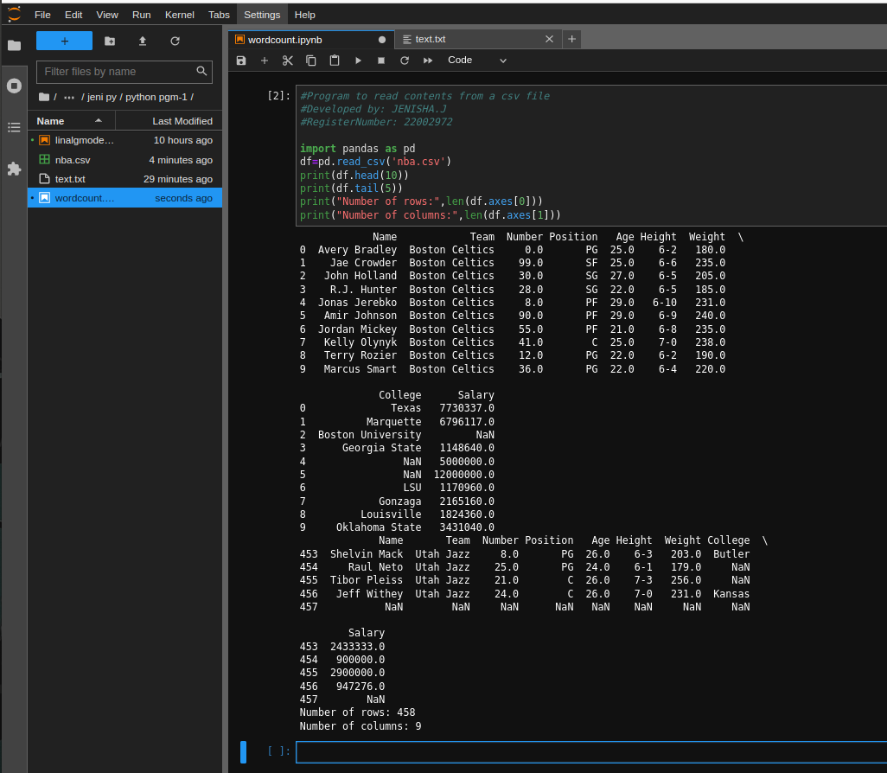

# Read-from-CSV

## AIM:
To write a python program for reading content from a CSV file.
## ALGORITHM:
### Step 1:
Import the module pandas as pd. 
### Step 2:
Load the csv into a dataframe.
### Step 3:
Print the number of contents to be displayed using df.head().
### Step 4:
The number of rows returned is defined in pandas option settings.
### Step 5:
Check your system's maximum coloumn with the pd.options.max_coloumn statement.
### Step 6:
Increase the maximum number of rows to display the entire DataFrame.
## PROGRAM:
```python
#Program to read contents from a csv file 
#Developed by: JENISHA.J
#RegisterNumber: 22002972

import pandas as pd 
df=pd.read_csv('nba.csv') 
print(df.head(10)) 
print(df.tail(5)) 
print("Number of rows:",len(df.axes[0])) 
print("Number of columns:",len(df.axes[1]))
```

## OUTPUT:

<br>

## RESULT:
Thus the program is wriiten in read csv file format.